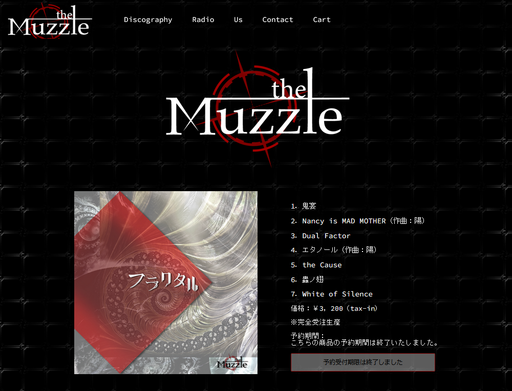
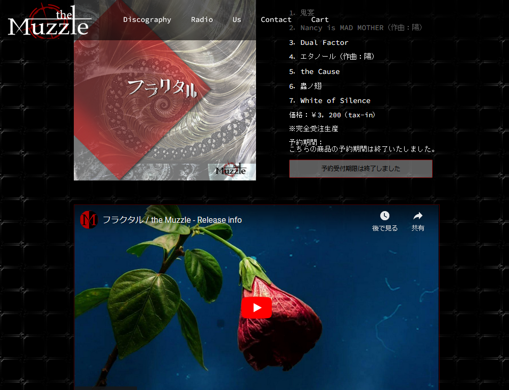

<h1 align="center" style="font-weight: bold;">muzzle.online</h1>

    <a href="#info">Information</a>
    <a href="#tech">Technologies</a>

    

    
    

<h1 align="center" id="info" style="font-weight: bold;">
    <em>Information</em>
</h1>

The goal of this project was about to develop a site from a favorite Japanese band <b>the Muzzle</b>, and to practice HTML/CSS and Javascript.

※ The original site has some problems with responsiveness and content centralization.

※ This project still under development, not the final version.

<h2 id="tech" style="font-weight: bold;">
    <em>Technologies</em>
</h2>

This project was built using HTML/CSS and Javascript.

Copyright © 2019-2023 the Muzzle All Rights Reserved.
